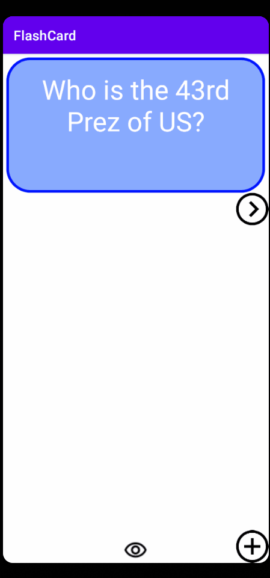
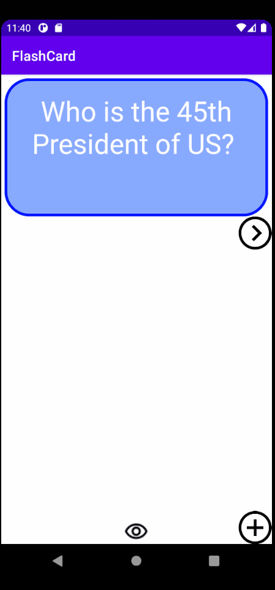
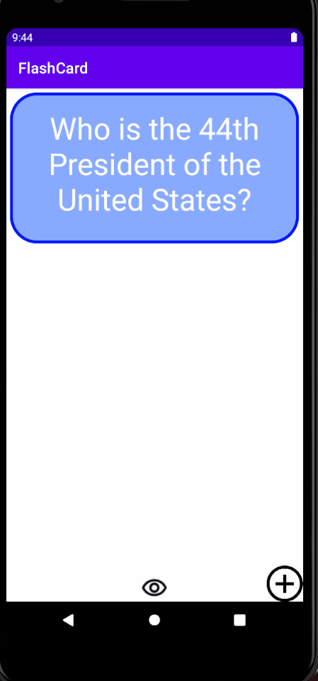
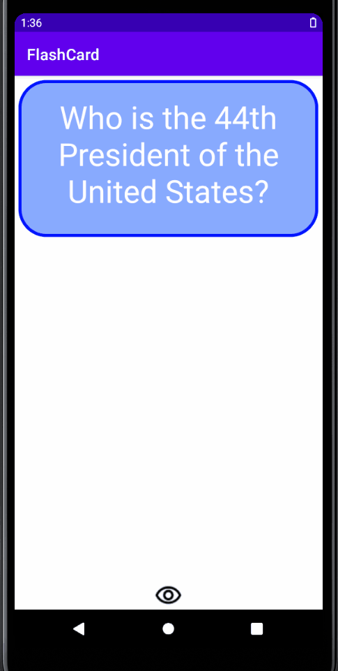

# Lab 4
## FlashCard Application: Demo
### Required Tasks
  - [x] Start by opening Android Studio and running your app to make sure everything still works as expected.
  - [x] Add a launcher icon for your app!
  - [x] Add a transition animation when the app goes from MainActivity to AddCardActivity
  - [x] Add an animation for when the answer is revealed.
  - [x] Add a sliding animation for when the user advances to the next card.
  - [x] Add some last touches!

# Lab 3
## FlashCard Application: Demo
### Required Tasks
  - [x] Start by opening Android Studio and running your app to make sure everything still works as expected.
  - [x] Add the necessary dependencies to start setting up the app's database
  - [x] Create the database related files
  - [x] Allow user to create a card and still see their created card when the app is relaunched.
  - [x] User should be able to create multiple cards and browse through their deck of created cards

# Lab 2
## FlashCard Application: Demo
### Required Tasks
  - [x] Start by opening Android Studio and running your app to make sure everything still works as expected.
  - [x] Add a ‘+’ button that takes the user to new ‘Add Card Screen’
  - [x] Add a Cancel button to the 'Add Card Screen'
  - [x] Add two fields to the 'Add Card Screen' that will allow the user to enter the Question and the Answer
  - [x] Add a Save button that will dismiss 'Add Card Screen' and return to the Main Activity where the user can see the card they just created
  - [x] Push your code to GitHub!

# Lab 1
## FlashCard Application: Demo
### Required Tasks

  - [x] Add a view for the front side of the flashcard to display the question
  - [x] Add a view for the back side of the flashcard to display the answer
  - [x] Build in logic to show the answer side when the card is tapped

### Optional Tasks

  - [x] Build in logic to toggle the flashcard between the question side and the answer side
  - [x] Style the question and answer side of the card to better distinguish between the two sides
  - [x] Further customize and style the card
  - [x] Add selectable multiple choice answers beneath the card
  - [x] Change the background color of the multiple choice answers when clicked to indicate whether the question was answered correctly
  - [x] Add a button that will toggle hiding and showing the answer choices

  

