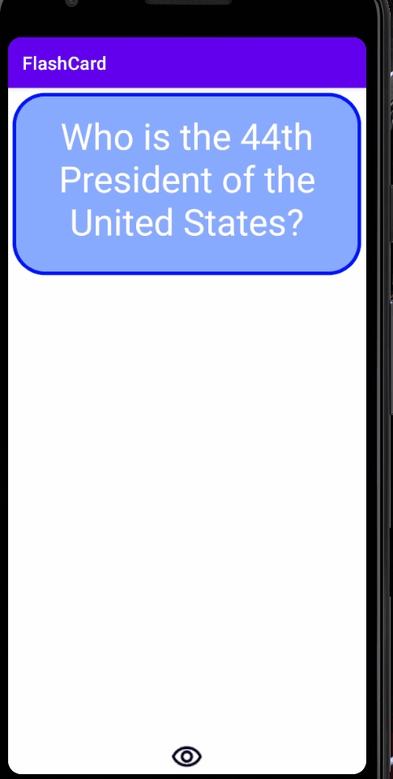

<h1>Lab 1</h1>
<h2> FlashCard Application: Demo</h2>
<h3>Required Tasks</h3>

  -[x]Add a view for the front side of the flashcard to display the question
  -[x]Add a view for the back side of the flashcard to display the answer
  -[x]Build in logic to show the answer side when the card is tapped

<h3>Optional Tasks</h3>

  -[x]Build in logic to toggle the flashcard between the question side and the answer side
  -[x]Style the question and answer side of the card to better distinguish between the two sides
  -[x]Further customize and style the card
  -[x]Add selectable multiple choice answers beneath the card
  -[x]Change the background color of the multiple choice answers when clicked to indicate whether the question was answered correctly
  -[x]Add a button that will toggle hiding and showing the answer choices

  

